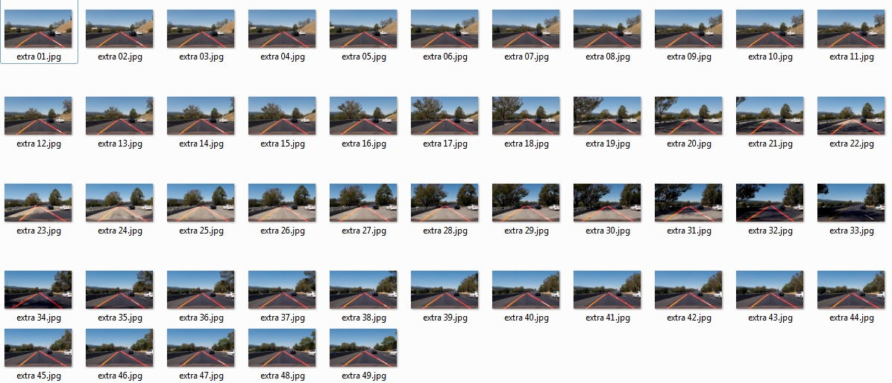

#**Finding Lane Lines on the Road** 

Overview
---

When we drive, we use our eyes to decide where to go.  The lines on the road that show us where the lanes are act as our constant reference for where to steer the vehicle.  Naturally, one of the first things we would like to do in developing a self-driving car is to automatically detect lane lines using an algorithm.

In this project you will detect lane lines in images using Python and OpenCV.  OpenCV means "Open-Source Computer Vision", which is a package that has many useful tools for analyzing images.  

Writeup
---

1. Describe the pipeline
2. Identify any shortcomings
3. Suggest possible improvements

1-1. pipeline 1 
---
1) defining region of interest  
   - I define triangle area as like below.
   
   - left ~ right : width/50 ~ (width - (width/50)), height
     
   - top: width / 2, 2/height + 50
     

2) Canney Edge Detection 
   - http://docs.opencv.org/trunk/da/d22/tutorial_py_canny.html
   - gray
   - gausian blur 
   - low_threshold 150, high_threshold 200  (my configuration)

3) Hough Line Detection 
   - http://docs.opencv.org/2.4.10/doc/tutorials/imgproc/imgtrans/hough_lines/hough_lines.html
   - threshold 10, min_line_len 50, max_line_gap 180  (my configuration)
   
4) extrapolate lines

   - Mean value of slopes and biases on each image : y = mx + b
  
   - sthreshold 0.2 : dropping out slope between 0 and -0.2. dropping out slope between 0 and 0.2
   
   - blank 30 : 30 = 60/2.  60 pixeles to make minimum blank width between left and right line. 
   
   
All Lanes are  detected and lines are reasonablly drawn on all video frames using above configuration. However, I encountered many exceptions (ZeroDivisionError) when I try above pipeline to challenge.mp4. 

1-2. pipeline 2 
---
1) Normalize image frame
   - red pixel value and green pixel value below 220 are converted to 20.
   
Most of Lanes are  detected and lines are reasonablly drawn on challenge.mp4 

2. shortcomings
---
1) Above pipeline can not reasonably detect lanes when the road is shadowed a lot. 
   - eg.) extra33.jpg
   
2) extrapolated lines are jittered. 
   - Lanes should be stabilized when some application need polished graphics  

3. Possible improvement. 
---
1) Lanes on real roads are more complicated than above videos. I need to configure out more robust pipeline with more road data.
   
